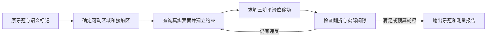

# Crown deformation

## 牙冠形变流程

从原始牙冠建立约束，检查实际间隙，再输出形变结果。

## 位移能量

在原始牙冠上构造余切刚度矩阵 K 和表面质量矩阵 M。

\[
E(u)=\frac{1}{2}\sum_{a\in\{x,y,z\}}u_a^{\mathsf T}Hu_a
\]

## 平滑矩阵 H

\[
H=(K+M/\ell^2)M^{-1}(K+M/\ell^2)M^{-1}(K+M/\ell^2)
\]

## H 的展开式

\[
\begin{aligned}
H={}&KM^{-1}KM^{-1}K\\
 &+\frac{3}{\ell^2}KM^{-1}K\\
 &+\frac{3}{\ell^4}K+\frac{1}{\ell^6}M
\end{aligned}
\]
