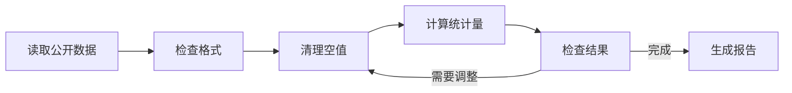

# Preview examples

## 数据处理流程

这是一组虚构的通用示例，用于展示图表和公式。

## 平均值

对一组数值计算算术平均值。

\[
\bar{x}=\frac{1}{n}\sum_{i=1}^{n}x_i
\]

## 方差

\[
\sigma^2=\frac{1}{n}\sum_{i=1}^{n}(x_i-\bar{x})^2
\]

## 二项式展开

\[
\begin{aligned}
(a+b)^2&=a^2+2ab+b^2\\
(a-b)^2&=a^2-2ab+b^2\\
(a+b)(a-b)&=a^2-b^2
\end{aligned}
\]
